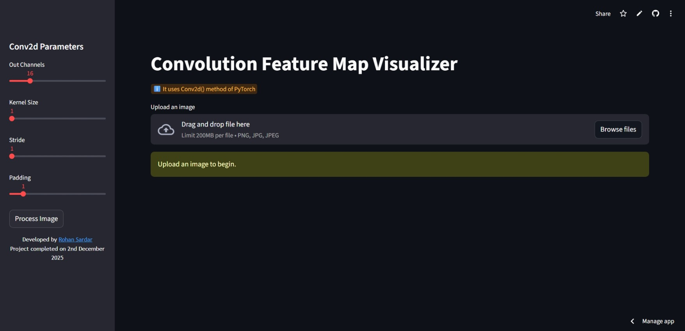

# Convolution Feature Map Visualizer 🏞️

A **Streamlit-based web app** that allows you to visualize the feature maps generated by a convolution layer (`Conv2d`) in PyTorch. This tool is perfect for understanding how convolutional filters interact with images and exploring deep learning fundamentals.

## Features

* Upload an image in PNG, JPG, or JPEG format.
* Adjust convolution parameters using an interactive sidebar:

  * **Out Channels**: Number of convolutional filters.
  * **Kernel Size**: Size of each convolutional filter.
  * **Stride**: Step size for sliding the kernel over the image.
  * **Padding**: Zero-padding added to the input image.
* Visualize each feature map in a grid layout.
* Developed entirely with **PyTorch**, **Torchvision**, **PIL**, **Matplotlib**, and **Streamlit**.

## Demo



## Installation

1. **Clone the repository**:

```bash
git clone https://github.com/RohanSardar/Conv2dVisualization
cd Conv2dVisualization
```

2. **Create and activate a virtual environment** (optional but recommended):

```bash
python -m venv venv
source venv/bin/activate  # Linux/Mac
venv\Scripts\activate     # Windows
```

3. **Install dependencies**:

```bash
pip install -r requirements.txt
```

## Usage

1. **Run the Streamlit app**:

```bash
streamlit run app.py
```

2. **Upload an image** through the sidebar.
3. **Adjust convolution parameters**.
4. **Click "Process Image"** to visualize the feature maps.

## Convolution Parameters

* **Out Channels**: Controls how many different features the convolution layer extracts.
* **Kernel Size**: Determines the size of the filter used to scan the image.
* **Stride**: Determines how much the filter moves at each step.
* **Padding**: Adds zeros around the image to control output size.

## Example Output

Each filter produces a feature map showing **activated patterns** from the input image. This visualization helps understand how convolution layers detect edges, textures, and more complex patterns.

## Built With

* Python
* Streamlit
* PyTorch
* Torchvision
* PIL / Pillow
* Matplotlib

## Author

Developed by **[Rohan Sardar](https://linktr.ee/RohanSardar)**
Project completed on 2nd December 2025.
